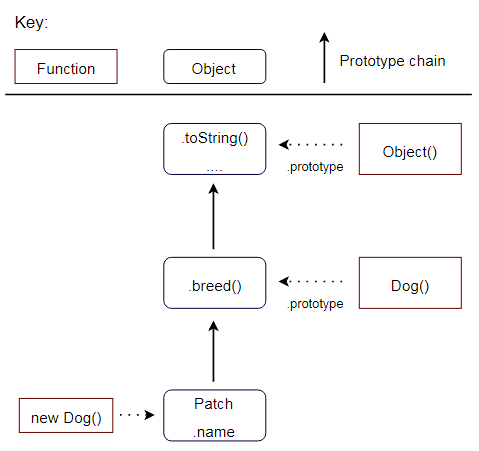

# Prototype based programming

## Introduction

Prototype based programming is a style of object orientated programming. It is commonly referred to as object based programming because it lacks classes and instead relies solely on objects. Objects can contain values, methods or references to other objects. 

Self was designed in 1986 and was one of the first prototype orientated programming languages. In recent years the paradigm has become increasingly popular due to the rise of JavaScript. Traditionally JavaScript was used as a scripting language. However, the expanding complexity of front-end applications and the development of Node.js on the server-side has resulted in the JavaScript community progressively favouring a prototype based approach. 

Today we will discuss the historical background of prototype based programming, how prototypes can be used, and their main advantages and limitations. We will also canvas JavaScript classes that were introduced in ECMAScript 2015 and explain why their introduction has been criticised by some commentators as syntactic sugar for JavaScript's existing prototype based system. To conclude, a reflection will be offered on prototype based programming in the context of other programming paradigms. 

Although many languages now support prototype based programming, JavaScript examples will be used.

## Historical background

The idea of a prototype stems back to a philosophical dispute on the representation of abstractions in the 20th century. Ludwig Wittgenstein at the time observed that it was difficult to say in advance exactly what characteristics are necessary to define a category. Wittgenstein instead proposed what can now be considered the origin of prototype based programming - the concept of family resemblance. This concept advocates that objects in a particular category may be connected via numerous similarities, but there is not necessarily one feature that is common to all objects in a category. Thus, the family resemblance approach determines whether an object belongs in a category by considering whether it is similar to a standard representation of that category.

Henry Lieberman popularised prototypes and the concept of delegation as an alternative object orientated paradigm in his 1986 paper. Lieberman introduced prototypes with an example of trying to categorise elephants. In short, the example considers an individual, John, who has never heard of or seen an elephant before. If John was to meet an elephant named Bob, then when thinking about elephants John would think of Bob because that is the only concrete example John has of an elephant. If John was to then meet another elephant, Sarah, who is smaller than Bob - John is likely to categorise Sarah as similar to Bob but smaller in size. 

Lieberman's example illustrates how the primary idea behind prototype based programming is to use a concrete example to represent an object, and then use cloning or adding of new properties to present newfound knowledge of the model.

## Object creation

An object is a collection of properties. A property is an association between a key and a value. A property's value can also be a function, in which case the property is referred to as a method. Although there are multiple approaches to creating objects in JavaScript, they all fall into one of two categories: ex nihilo object creation or through cloning an existing object. 

Ex nihilo object creation allows new objects to be created without cloning from an existing defined object. 

```js
// An object created ex nihilo using literal object notation
var dog = { name: 'Max', breed: 'Poodle' };
```

An alternative to using literal object notation is to write a constructor function and create new object instances with the reserved word `new`. Each instance of the object will have its own properties.

```js
function Dog(name, breed) {
    this.name = name;
    this.breed = breed;
    bark: function() {
        console.log("Woof!");
    };
};        

var poodle = new Dog('Max', 'Poodle');
var dalmatian = new Dog('Bobby', 'Dalmatian');

console.log(poodle.name); // Output is 'Max'
console.log(dalmatian.name); // Output is 'Bobby'
```

The `Object.create` method can be used in place of a explicitly defined constructor function.  
```js
var Dog = {
    name = "Max";
    breed = "Poodle";
    bark: function() {
        console.log("Woof!");
    };
};

var max = Object.create(Dog);
max.bark(); // Output is 'Woof!'
```

A new object can also be created by cloning the behaviour of an existing object. The cloned object will have the same properties as the original. Once created, the new object can also be modified.

```js
var dog = { name: 'Max', breed: 'Poodle' };

// The newDog object is created by cloning the dog object
var newDog = Object.assign({}, dog);

console.log(dog.name); // Output is 'Max'
console.log(newDog.name); // Output is 'Max'

newDog.name = "Jessica";

console.log(dog.name); // Output is 'Max'
console.log(newDog.name); // Output is 'Jessica'
```

## Delegation and Inheritance 

The language feature that supports prototype based programming is delegation. Objects can be cloned and extended via delegation. This principle provides that when accessing a property of an object, the property will be sought on the object and also all other objects in the prototype chain. Objects inherit directly through a `prototype` property. Every object has a prototype link to another object. Objects by default are linked to the object `Object.prototype`.

```js
var Dog = function() {
    this.name = "Patch";
}

var patch = new Dog();

Dog.prototype.breed = "Great Dane";

console.log(patch.name); // Output is 'Patch'
console.log(patch.breed); // Output is 'Great Dane'
```

In the above example, the `patch` object contains the `name` property. The `breed` property is also found by traversing the prototype chain and accessing its prototype. Using the `.prototype` property of `Dog`, new properties can be assigned so that when a new object is created from the `Dog` constructor function, those properties will be available to the new object.

The prototype chain in this example can be visually illustrated as follows:

<p align="center">
    
</p>

If you're a visual learner, [Dave Atchley](https://www.datchley.name/understanding-prototypes-delegation-composition/) provides many more examples.

All objects can be altered or extended using prototypes, including JavaScript's native object prototypes such as string and array. However, this is generally considered bad practice particularly from the point of view of code integration. It is very common to use use libraries and frameworks in JavaScript which rely upon the standard implementations of the native prototypes. In addition, when working within a team, modifications to the already existing JavaScript objects can cause confusion and hours of lost time. In almost all cases it is more appropriate to create a new object to encapsulate the desired functionality.

### Cloning

If an object is created by cloning using `Object.assign()`, then the top level properties of that object are copied to the new object without any reference. However, if a value is a reference to an object, then the reference will be copied and not the value.  

```js
var book = {
    id: 1,
    authors: {
        author1: "John Jims"
    }
};

var newBook = Object.assign({}, book);

console.log(book.authors.author1); // Output is 'John Jims'
console.log(newBook.authors.author1); // Output is 'John Jims'

// Update author1 value for the book object
book.authors.author1 = "Jess Simpson";

console.log(book.authors.author1); // Output is 'Jess Simpson'
console.log(newBook.authors.author1); // Output is 'Jess Simpson'
```

In the above example, `newBook` maintains a link to its prototype. Changes in the object reference to the prototype will cause a corresponding change in `newBook`.

### The use of 'this'

In prototype based programming, any function can be added to an object in the form of a property. An inherited property will behave the same as any other property. When an inherited function is invoked, the value of `this` will point to the inherited object, not the prototype object where the function is a property.

```js
var calculate = {
    num: 5,
    sum: function() {
        return this.num + 5;
    }
};

// When executing calculate.sum, 'this' refers to the calculate object
console.log(calculate.sum()); // Output is '10'

// modifier is an object that inherits from calculate
var modifier = Object.create(calculate);

modifier.num = 20;

// When executing modifier.sum, 'this' refers to the modifier object
console.log(modifier.sum()); // Output is '25'
```

### Performance

Most JavaScript engines use a dictionary-like data structure to store object properties. Consequently the lookup time for properties that are high in the prototype chain can have a negative impact on performance. 

Lookup operations are repeated every time a property or variable is accessed. Accessing a non-existent property will always result in a full traversal of the prototype chain. In addition, when iterating over the properties of an object, every enumerable property that is on the prototype chain will be enumerated. The consequence of this is that accessing properties in prototype based languages is typically much slower than accessing variables in languages such as Java.

## Prototypes vs. Classes

In class based languages classes are defined first and then objects are instantiated based on those classes. An object cannot exist without a class that defines its behaviour. Once an object is created, its behaviour can also not be extended. To this end classes provide a level of certainty. If dog and cat objects are instantiated from the class Animal, then it is reasonable for a programmer to expect the same attributes and behaviours on both objects.

Conversely, in prototype based languages objects are the primary entities. There is no class construct. The prototype of an object is just another object to which the object is linked. Only single inheritance can be implemented through a prototype as every object only has one prototype link.

New objects can be created based on existing objects. New behaviour can also be added to objects after their creation. Using prototypes, the method of sharing behaviour between objects is by delegation. When a variable or method is requested from an object and it does not know how to handle it, the object delegates its request to its list of prototypes. 

## JavaScript classes

JavaScript classes, introduced in ECMAScript 2015, provide a new means of creating a class by using the `class` keyword. However, the introduction of classes does not change the way that prototype inheritance works in JavaScript. Consequently, classes have been met with some criticism from parts of the JavaScript community as an unnecessary and convoluted addition to the language. 

There are two ways to define a class - by expression or by declaration.

An example of class expression:

```js
var book = class {
    constructor(title, author) {
        this.title = title;
        this.author = author;
    }
};
```

An example of class declaration:

```js
class Book {
    constructor(title, author) {
        this.title = title;
        this.author = author;
    }
};
```

Unlike function declarations, class declarations and expressions are not hoisted. This means that the class must be defined before it can be accessed.

```js
var b = new Book(); // Reference error here 

class Book {};
``` 

### Subclasses

The `extends` keyword can be used in class declarations and class expressions to create a class that is a child of another class.

```js
class Dog {
    constructor(name) {
        this.name = name;
    }

    woof() {
        console.log(`${this.name} woofs!`);
    }
};

class Puppy extends Dog {
    constructor(name) {
        super(name);
    }
};

var bobby = new Puppy('Bobby');
bobby.woof() // output is 'Bobby woofs!'
```

In this example `Puppy` is a child class of `Dog`. As a child class, `Puppy` can access and execute the `woof` function from its parent class.

### Criticism

JavaScript classes have been criticised by commentators as syntactic sugar over JavaScript's existing prototype based inheritance. Inspecting the `typeof` a class reveals that under the hood it is a function. This explains why the class can be used just like a constructor function by using the `new` keyword.  

As such, classes are said to obscure the true nature of JavaScript inheritance. There is a disconnect between what a class looks like (an object) and how it behaves (as a function). Classes in JavaScript also only provide single inheritance which limits a programmer's ability to express object oriented design.   

Perhaps the only saving grace for JavaScript classes are that they provide greater familiarity to programmers coming from class based languages such as Java, and are backwards compatible with most existing code.  

## Conclusion

Class based programming and prototype based programming both seek to implement the object orientated paradigm. Most programmers are familiar with class based programming due the popularity of languages such as C#, C++ and Java. However the rise of JavaScript, which adopts a prototype based approach, has meant that increasingly programmers are having to learn and use prototypes. JavaScript has tried to cater to programmers coming from popular object orientated languages by introducing a class syntax. But this has been criticised by some commentators as it does not replace the underlying prototype based system and arguably only adds further confusion. 

Prototype based programming provides greater freedom and flexibility to programmers because of its dynamic nature. Objects do not need a class to exist and are designed to have their behaviour easily cloned, shared or extended - even at runtime. The limitation to this approach is maintainability and performance, particularly in large scale projects. While a class based approach requires the programmer to adopt a more rigid approach in declaring classes and hierarchy at compile time, the benefit is greater robustness and performance. Consequently, the type of problem to be solved and valued characteristics of the envisaged system will more often than not decide the most appropriate object orientated approach to adopt.

# Further reading

[1] Allen, R. (2017). Self. Retrieved from http://www.selflanguage.org/

[2] Lieberman, H. (1986). Using Prototypical Objects to Implement Shared Behavior in Object Oriented Systems. Retrieved from http://web.media.mit.edu/~lieber/Lieberary/OOP/Delegation/Delegation.html

[3] Mozilla. (2018). Inheritance and the prototype chain. Retrieved from https://developer.mozilla.org/en-US/docs/Web/JavaScript/Inheritance_and_the_prototype_chain

[4] Atchley, D. (2015). Understanding Prototypes, Delegation & Composition. Retrieved from https://www.datchley.name/understanding-prototypes-delegation-composition/

[5] Zakas, N. (2010). Maintainable JavaScript: Don’t modify objects you don’t own. Retrieved from https://www.nczonline.net/blog/2010/03/02/maintainable-javascript-dont-modify-objects-you-down-own/

[6] Bruni, C. (2017). Fast Properties in V8. Retrieved from https://v8project.blogspot.com/2017/08/fast-properties.html

[7] Mozilla. (2018). Classes. Retrieved from https://developer.mozilla.org/en-US/docs/Web/JavaScript/Reference/Classes

[8] Bevacqua, N. (2015). ES6 Classes in Depth. Retrieved from https://ponyfoo.com/articles/es6-classes-in-depth

[9] Ryan, C. (2015). JavaScript ES6 Class Syntax. Retrieved from https://coryrylan.com/blog/javascript-es6-class-syntax